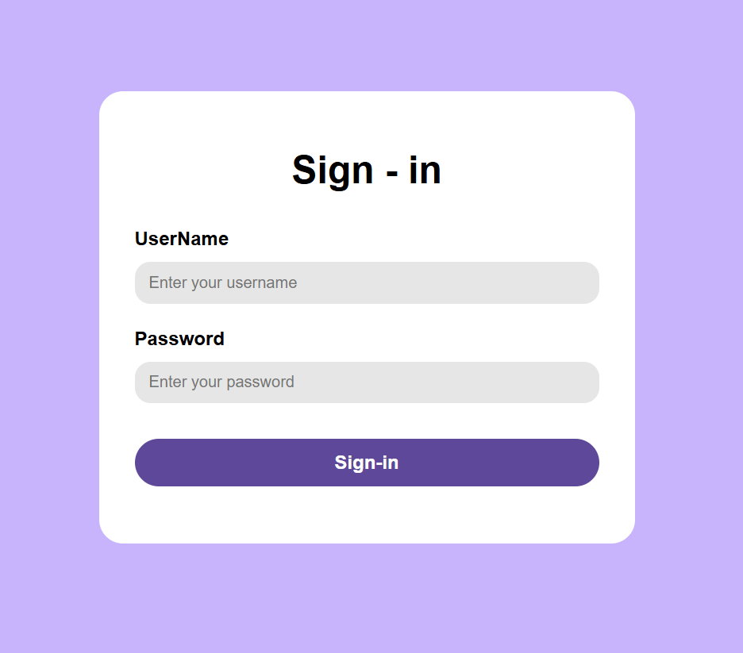

# DOM Manipulation Projects 🚀

A collection of beginner-friendly and intermediate **DOM Manipulation projects** built using **HTML, CSS, and JavaScript**.

These projects demonstrate how JavaScript can be used to dynamically create, modify, style, and interact with HTML elements through the **Document Object Model (DOM)**.

---

## 📂 Projects Included

### 📝 1. Basic Sign-In Form

A sign-in form created dynamically using **JavaScript DOM methods**.

Instead of writing the form elements directly in HTML, the elements are created and styled using JavaScript.

**Features:**
- Username input
- Password input
- Dynamically created labels and inputs
- Styled button
- Clean card-style UI
- DOM-based element creation and styling

#### 📸 Preview



---

### 🔐 2. Advanced Sign-In Form

A more polished sign-in form created using JavaScript DOM manipulation with a modern UI design.

**Features:**
- Modern gradient background
- Card-style form
- Box shadows
- Styled input fields
- Heading and subtitle
- Button hover effects
- Smooth and attractive UI

#### 📸 Preview


---

## 🛠️ Technologies Used

- **HTML5**
- **CSS3**
- **JavaScript**
- **DOM Manipulation**
- **JavaScript Events**

---

## 📚 Concepts Practiced

Through these projects, I am practicing:

- `document.createElement()`
- `appendChild()`
- `append()`
- `classList`
- `style`
- `textContent`
- `innerHTML`
- `setAttribute()`
- DOM element selection
- Event listeners
- Event handling
- Dynamic element creation
- Dynamic styling

---

## 📁 Repository Structure

```text
DOM-Manipulation-Projects/
│
├── images/
│   ├── form.png
│   └── sign-in-form.png
│
├── code3.html
├── code4.html
└── README.md
